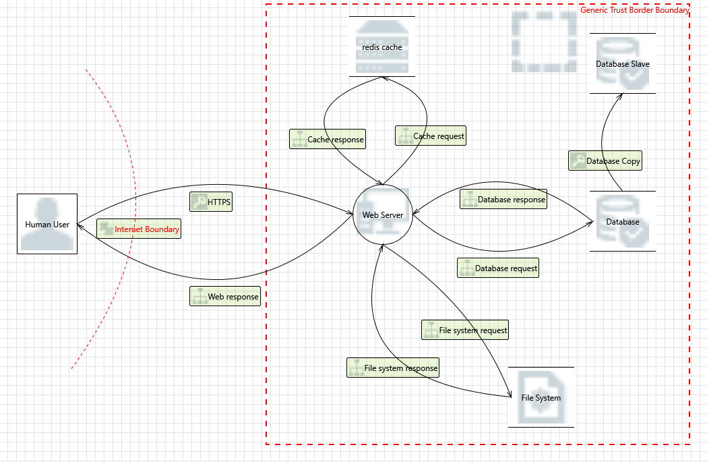
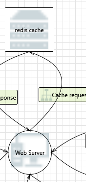
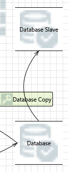
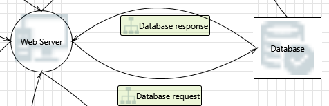
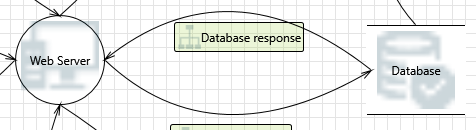
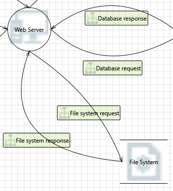
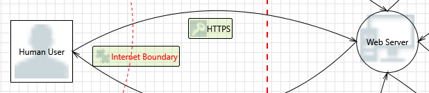
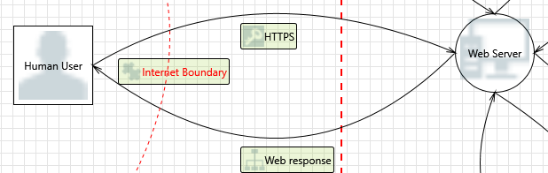

# Security Modeling

Een security model beschrijft nauwkeurig belangrijke aspecten van beveiliging en hun relatie tot systeemgedrag. Het primaire doel van een security model is het verschaffen van het benodigde begrips van de applicatie voor een succesvolle implementatie van belangrijke beveiligingseisen. Het beveiligingsbeleid speelt een primaire rol bij het bepalen van de inhoud van het security model. Voor de succesvolle ontwikkeling van een goed security model is daarom een duidelijk, goed afgerond beveiligingsbeleid nodig.

## Security Modeling Process

1. Vereisten voor de externe interface identificeren
1. Interne vereisten identificeren
1. Operationele ontwerpregels voor beleidshandhaving
1. Bepaal wat al gekend is
1. Consistentie en correctheid aantonen
1. Relevantie aantonen

## Threat Modeling Methodologies

Bij het versterken van de beveiliging van onze Nextcloud-implementatie was het essentieel om een threat modeling methodology te kiezen die aansluit bij onze doelstellingen. Na verschillende methodologieën te hebben geëvalueerd, kozen we voor Microsoft's STRIDE vanwege de gestructureerde aanpak specifiek voor softwaresystemen zoals Nextcloud. De zes dreigingscategorieën van STRIDE—Spoofing, Tampering, Repudiation, Information Disclosure, Denial of Service en Elevation of Privilege—zorgen voor een uitgebreide dekking van mogelijke kwetsbaarheden.

We hebben ook andere methodologieën overwogen:

- PASTA leek, hoewel risicocentrisch, tijdrovender.
- Attack Trees, hoewel visueel, misten de volledigheid die we zochten.
- OCTAVE bood een breder organisatorisch perspectief, maar we zochten een meer softwaregerichte focus.
- Trike was op activa gericht, terwijl we dreigingscategorisatie prioriteerden.

Gezien onze behoefte aan een directe, softwaregerichte beoordeling, kwam STRIDE naar voren als de meest geschikte keuze om onze Nextcloud-implementatie effectief te beveiligen.

**MOET NOG AANGEPAST WORDEN: specifiëren welke onderdelen van stride worden getest.**

## Low level threat model

Omdat we gebruik maken van de STRIDE methodologie kunnen we de Microsoft Thread Modeling Tool gebruiken.

# Threat Modeling Report

## Diagram: Nextcloud

### Interaction: Cache request

#### 1\. Spoofing of Destination Data Store redis cache  \[State: Not Started\]  \[Priority: High\] 

**Category:**

Spoofing

**Description:**

redis cache may be spoofed by an attacker and this may lead to data being written to the attacker's target instead of redis cache. Consider using a standard authentication mechanism to identify the destination data store.

**Justification:**

<no mitigation provided>

#### 2\. Potential Excessive Resource Consumption for Web Server or redis cache  \[State: Not Started\]  \[Priority: High\] 

**Category:**

Denial Of Service

**Description:**

Does Web Server or redis cache take explicit steps to control resource consumption? Resource consumption attacks can be hard to deal with, and there are times that it makes sense to let the OS do the job. Be careful that your resource requests don't deadlock, and that they do timeout.

**Justification:**

<no mitigation provided>

#### 3\. Risks from Logging  \[State: Not Started\]  \[Priority: High\] 

**Category:**

Tampering

**Description:**

Log readers can come under attack via log files. Consider ways to canonicalize data in all logs. Implement a single reader for the logs, if possible, in order to reduce attack surface area. Be sure to understand and document log file elements which come from untrusted sources.

**Justification:**

<no mitigation provided>

#### 4\. Lower Trusted Subject Updates Logs  \[State: Not Started\]  \[Priority: High\] 

**Category:**

Repudiation

**Description:**

If you have trust levels, is anyone other outside of the highest trust level allowed to log? Letting everyone write to your logs can lead to repudiation problems. Only allow trusted code to log.

**Justification:**

<no mitigation provided>

#### 5\. Data Logs from an Unknown Source  \[State: Not Started\]  \[Priority: High\] 

**Category:**

Repudiation

**Description:**

Do you accept logs from unknown or weakly authenticated users or systems? Identify and authenticate the source of the logs before accepting them.

**Justification:**

<no mitigation provided>

#### 6\. Insufficient Auditing  \[State: Not Started\]  \[Priority: High\] 

**Category:**

Repudiation

**Description:**

Does the log capture enough data to understand what happened in the past? Do your logs capture enough data to understand an incident after the fact? Is such capture lightweight enough to be left on all the time? Do you have enough data to deal with repudiation claims? Make sure you log sufficient and appropriate data to handle a repudiation claims. You might want to talk to an audit expert as well as a privacy expert about your choice of data.

**Justification:**

<no mitigation provided>

#### 7\. Potential Weak Protections for Audit Data  \[State: Not Started\]  \[Priority: High\] 

**Category:**

Repudiation

**Description:**

Consider what happens when the audit mechanism comes under attack, including attempts to destroy the logs, or attack log analysis programs. Ensure access to the log is through a reference monitor, which controls read and write separately. Document what filters, if any, readers can rely on, or writers should expect

**Justification:**

<no mitigation provided>

#### 8\. Authorization Bypass  \[State: Not Started\]  \[Priority: High\] 

**Category:**

Information Disclosure

**Description:**

Can you access redis cache and bypass the permissions for the object? For example by editing the files directly with a hex editor, or reaching it via filesharing? Ensure that your program is the only one that can access the data, and that all other subjects have to use your interface.

**Justification:**

<no mitigation provided>

### Interaction: Cache response

#### 9\. Cross Site Scripting  \[State: Not Started\]  \[Priority: High\] 

**Category:**

Tampering

**Description:**

The web server 'Web Server' could be a subject to a cross-site scripting attack because it does not sanitize untrusted input.

**Justification:**

<no mitigation provided>

#### 10\. Spoofing of Source Data Store redis cache  \[State: Not Started\]  \[Priority: High\] 

**Category:**

Spoofing

**Description:**

redis cache may be spoofed by an attacker and this may lead to incorrect data delivered to Web Server. Consider using a standard authentication mechanism to identify the source data store.

**Justification:**

<no mitigation provided>

#### 11\. Persistent Cross Site Scripting  \[State: Not Started\]  \[Priority: High\] 

**Category:**

Tampering

**Description:**

The web server 'Web Server' could be a subject to a persistent cross-site scripting attack because it does not sanitize data store 'redis cache' inputs and output.

**Justification:**

<no mitigation provided>

#### 12\. Weak Access Control for a Resource  \[State: Not Started\]  \[Priority: High\] 

**Category:**

Information Disclosure

**Description:**

Improper data protection of redis cache can allow an attacker to read information not intended for disclosure. Review authorization settings.

**Justification:**

<no mitigation provided>

#### 13\. Risks from Logging  \[State: Not Started\]  \[Priority: High\] 

**Category:**

Tampering

**Description:**

Log readers can come under attack via log files. Consider ways to canonicalize data in all logs. Implement a single reader for the logs, if possible, in order to reduce attack surface area. Be sure to understand and document log file elements which come from untrusted sources.

**Justification:**

<no mitigation provided>

### Interaction: Database Copy

#### 14\. Spoofing of Source Data Store Database  \[State: Not Started\]  \[Priority: High\] 

**Category:**

Spoofing

**Description:**

Database may be spoofed by an attacker and this may lead to incorrect data delivered to Database Slave. Consider using a standard authentication mechanism to identify the source data store.

**Justification:**

<no mitigation provided>

#### 15\. Spoofing of Destination Data Store Database Slave  \[State: Not Started\]  \[Priority: High\] 

**Category:**

Spoofing

**Description:**

Database Slave may be spoofed by an attacker and this may lead to data being written to the attacker's target instead of Database Slave. Consider using a standard authentication mechanism to identify the destination data store.

**Justification:**

<no mitigation provided>

### Interaction: Database request

#### 16\. Potential Excessive Resource Consumption for Web Server or Database  \[State: Not Started\]  \[Priority: High\] 

**Category:**

Denial Of Service

**Description:**

Does Web Server or Database take explicit steps to control resource consumption? Resource consumption attacks can be hard to deal with, and there are times that it makes sense to let the OS do the job. Be careful that your resource requests don't deadlock, and that they do timeout.

**Justification:**

<no mitigation provided>

#### 17\. Potential SQL Injection Vulnerability for Database  \[State: Not Started\]  \[Priority: High\] 

**Category:**

Tampering

**Description:**

SQL injection is an attack in which malicious code is inserted into strings that are later passed to an instance of SQL Server for parsing and execution. Any procedure that constructs SQL statements should be reviewed for injection vulnerabilities because SQL Server will execute all syntactically valid queries that it receives. Even parameterized data can be manipulated by a skilled and determined attacker.

**Justification:**

<no mitigation provided>

#### 18\. Spoofing of Destination Data Store Database  \[State: Not Started\]  \[Priority: High\] 

**Category:**

Spoofing

**Description:**

Database may be spoofed by an attacker and this may lead to data being written to the attacker's target instead of Database. Consider using a standard authentication mechanism to identify the destination data store.

**Justification:**

<no mitigation provided>

#### 19\. Weak Credential Storage  \[State: Not Started\]  \[Priority: High\] 

**Category:**

Information Disclosure

**Description:**

Credentials held at the server are often disclosed or tampered with and credentials stored on the client are often stolen. For server side, consider storing a salted hash of the credentials instead of storing the credentials themselves. If this is not possible due to business requirements, be sure to encrypt the credentials before storage, using an SDL-approved mechanism. For client side, if storing credentials is required, encrypt them and protect the data store in which they're stored

**Justification:**

<no mitigation provided>

#### 20\. Authorization Bypass  \[State: Not Started\]  \[Priority: High\] 

**Category:**

Information Disclosure

**Description:**

Can you access Database and bypass the permissions for the object? For example by editing the files directly with a hex editor, or reaching it via filesharing? Ensure that your program is the only one that can access the data, and that all other subjects have to use your interface.

**Justification:**

<no mitigation provided>

### Interaction: Database response

#### 21\. Weak Access Control for a Resource  \[State: Not Started\]  \[Priority: High\] 

**Category:**

Information Disclosure

**Description:**

Improper data protection of Database can allow an attacker to read information not intended for disclosure. Review authorization settings.

**Justification:**

<no mitigation provided>

#### 22\. Persistent Cross Site Scripting  \[State: Not Started\]  \[Priority: High\] 

**Category:**

Tampering

**Description:**

The web server 'Web Server' could be a subject to a persistent cross-site scripting attack because it does not sanitize data store 'Database' inputs and output.

**Justification:**

<no mitigation provided>

#### 23\. Cross Site Scripting  \[State: Not Started\]  \[Priority: High\] 

**Category:**

Tampering

**Description:**

The web server 'Web Server' could be a subject to a cross-site scripting attack because it does not sanitize untrusted input.

**Justification:**

<no mitigation provided>

#### 24\. Spoofing of Source Data Store Database  \[State: Not Started\]  \[Priority: High\] 

**Category:**

Spoofing

**Description:**

Database may be spoofed by an attacker and this may lead to incorrect data delivered to Web Server. Consider using a standard authentication mechanism to identify the source data store.

**Justification:**

<no mitigation provided>

### Interaction: File system request

#### 25\. Potential Excessive Resource Consumption for Web Server or File System  \[State: Not Started\]  \[Priority: High\] 

**Category:**

Denial Of Service

**Description:**

Does Web Server or File System take explicit steps to control resource consumption? Resource consumption attacks can be hard to deal with, and there are times that it makes sense to let the OS do the job. Be careful that your resource requests don't deadlock, and that they do timeout.

**Justification:**

<no mitigation provided>

#### 26\. Spoofing of Destination Data Store File System  \[State: Not Started\]  \[Priority: High\] 

**Category:**

Spoofing

**Description:**

File System may be spoofed by an attacker and this may lead to data being written to the attacker's target instead of File System. Consider using a standard authentication mechanism to identify the destination data store.

**Justification:**

<no mitigation provided>

#### 27\. Authorization Bypass  \[State: Not Started\]  \[Priority: High\] 

**Category:**

Information Disclosure

**Description:**

Can you access File System and bypass the permissions for the object? For example by editing the files directly with a hex editor, or reaching it via filesharing? Ensure that your program is the only one that can access the data, and that all other subjects have to use your interface.

**Justification:**

<no mitigation provided>

### Interaction: File system response

#### 28\. Cross Site Scripting  \[State: Not Started\]  \[Priority: High\] 

**Category:**

Tampering

**Description:**

The web server 'Web Server' could be a subject to a cross-site scripting attack because it does not sanitize untrusted input.

**Justification:**

<no mitigation provided>

#### 29\. Spoofing of Source Data Store File System  \[State: Not Started\]  \[Priority: High\] 

**Category:**

Spoofing

**Description:**

File System may be spoofed by an attacker and this may lead to incorrect data delivered to Web Server. Consider using a standard authentication mechanism to identify the source data store.

**Justification:**

<no mitigation provided>

#### 30\. Weak Access Control for a Resource  \[State: Not Started\]  \[Priority: High\] 

**Category:**

Information Disclosure

**Description:**

Improper data protection of File System can allow an attacker to read information not intended for disclosure. Review authorization settings.

**Justification:**

<no mitigation provided>

#### 31\. Persistent Cross Site Scripting  \[State: Not Started\]  \[Priority: High\] 

**Category:**

Tampering

**Description:**

The web server 'Web Server' could be a subject to a persistent cross-site scripting attack because it does not sanitize data store 'File System' inputs and output.

**Justification:**

<no mitigation provided>

### Interaction: HTTPS

#### 32\. Elevation Using Impersonation  \[State: Not Started\]  \[Priority: High\] 

**Category:**

Elevation Of Privilege

**Description:**

Web Server may be able to impersonate the context of Human User in order to gain additional privilege.

**Justification:**

<no mitigation provided>

#### 33\. Cross Site Scripting  \[State: Not Started\]  \[Priority: High\] 

**Category:**

Tampering

**Description:**

The web server 'Web Server' could be a subject to a cross-site scripting attack because it does not sanitize untrusted input.

**Justification:**

<no mitigation provided>

#### 34\. Spoofing the Human User External Entity  \[State: Not Started\]  \[Priority: High\] 

**Category:**

Spoofing

**Description:**

Human User may be spoofed by an attacker and this may lead to unauthorized access to Web Server. Consider using a standard authentication mechanism to identify the external entity.

**Justification:**

<no mitigation provided>

#### 35\. Potential Data Repudiation by Web Server  \[State: Not Started\]  \[Priority: High\] 

**Category:**

Repudiation

**Description:**

Web Server claims that it did not receive data from a source outside the trust boundary. Consider using logging or auditing to record the source, time, and summary of the received data.

**Justification:**

<no mitigation provided>

#### 36\. Potential Process Crash or Stop for Web Server  \[State: Not Started\]  \[Priority: High\] 

**Category:**

Denial Of Service

**Description:**

Web Server crashes, halts, stops or runs slowly; in all cases violating an availability metric.

**Justification:**

<no mitigation provided>

#### 37\. Data Flow HTTPS Is Potentially Interrupted  \[State: Not Started\]  \[Priority: High\] 

**Category:**

Denial Of Service

**Description:**

An external agent interrupts data flowing across a trust boundary in either direction.

**Justification:**

<no mitigation provided>

#### 38\. Web Server May be Subject to Elevation of Privilege Using Remote Code Execution  \[State: Not Started\]  \[Priority: High\] 

**Category:**

Elevation Of Privilege

**Description:**

Human User may be able to remotely execute code for Web Server.

**Justification:**

<no mitigation provided>

#### 39\. Elevation by Changing the Execution Flow in Web Server  \[State: Not Started\]  \[Priority: High\] 

**Category:**

Elevation Of Privilege

**Description:**

An attacker may pass data into Web Server in order to change the flow of program execution within Web Server to the attacker's choosing.

**Justification:**

<no mitigation provided>

#### 40\. Cross Site Request Forgery  \[State: Not Started\]  \[Priority: High\] 

**Category:**

Elevation Of Privilege

**Description:**

Cross-site request forgery (CSRF or XSRF) is a type of attack in which an attacker forces a user's browser to make a forged request to a vulnerable site by exploiting an existing trust relationship between the browser and the vulnerable web site. In a simple scenario, a user is logged in to web site A using a cookie as a credential. The other browses to web site B. Web site B returns a page with a hidden form that posts to web site A. Since the browser will carry the user's cookie to web site A, web site B now can take any action on web site A, for example, adding an admin to an account. The attack can be used to exploit any requests that the browser automatically authenticates, e.g. by session cookie, integrated authentication, IP whitelisting. The attack can be carried out in many ways such as by luring the victim to a site under control of the attacker, getting the user to click a link in a phishing email, or hacking a reputable web site that the victim will visit. The issue can only be resolved on the server side by requiring that all authenticated state-changing requests include an additional piece of secret payload (canary or CSRF token) which is known only to the legitimate web site and the browser and which is protected in transit through SSL/TLS. See the Forgery Protection property on the flow stencil for a list of mitigations.

**Justification:**

<no mitigation provided>

### Interaction: Web response

#### 41\. Spoofing of the Human User External Destination Entity  \[State: Not Started\]  \[Priority: High\] 

**Category:**

Spoofing

**Description:**

Human User may be spoofed by an attacker and this may lead to data being sent to the attacker's target instead of Human User. Consider using a standard authentication mechanism to identify the external entity.

**Justification:**

<no mitigation provided>

#### 42\. External Entity Human User Potentially Denies Receiving Data  \[State: Not Started\]  \[Priority: High\] 

**Category:**

Repudiation

**Description:**

Human User claims that it did not receive data from a process on the other side of the trust boundary. Consider using logging or auditing to record the source, time, and summary of the received data.

**Justification:**

<no mitigation provided>

#### 43\. Data Flow Web response Is Potentially Interrupted  \[State: Not Started\]  \[Priority: High\] 

**Category:**

Denial Of Service

**Description:**

An external agent interrupts data flowing across a trust boundary in either direction.

**Justification:**

<no mitigation provided>
