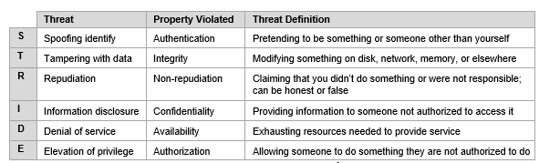

# Security Modeling

Een security model beschrijft nauwkeurig belangrijke aspecten van beveiliging en hun relatie tot systeemgedrag. Het primaire doel van een security model is het verschaffen van het benodigde begrips van de applicatie voor een succesvolle implementatie van belangrijke beveiligingseisen. Het beveiligingsbeleid speelt een primaire rol bij het bepalen van de inhoud van het security model. Voor de succesvolle ontwikkeling van een goed security model is daarom een duidelijk, goed afgerond beveiligingsbeleid nodig.

## Security Modeling Process

1. Vereisten voor de externe interface identificeren
1. Interne vereisten identificeren
1. Operationele ontwerpregels voor beleidshandhaving
1. Bepaal wat al gekend is
1. Consistentie en correctheid aantonen
1. Relevantie aantonen

## Threat Modeling Methodologies

Bij het versterken van de beveiliging van onze Nextcloud-implementatie was het essentieel om een threat modeling methodology te kiezen die aansluit bij onze doelstellingen. Na verschillende methodologieën te hebben geëvalueerd, kozen we voor Microsoft's STRIDE vanwege de gestructureerde aanpak specifiek voor softwaresystemen zoals Nextcloud. De zes dreigingscategorieën van STRIDE—Spoofing, Tampering, Repudiation, Information Disclosure, Denial of Service en Elevation of Privilege—zorgen voor een uitgebreide dekking van mogelijke kwetsbaarheden.

We hebben ook andere methodologieën overwogen:

- PASTA leek, hoewel risicocentrisch, tijdrovender.
- Attack Trees, hoewel visueel, misten de volledigheid die we zochten.
- OCTAVE bood een breder organisatorisch perspectief, maar we zochten een meer softwaregerichte focus.
- Trike was op activa gericht, terwijl we dreigingscategorisatie prioriteerden.

Gezien onze behoefte aan een directe, softwaregerichte beoordeling, kwam STRIDE naar voren als de meest geschikte keuze om onze Nextcloud-implementatie effectief te beveiligen.

**MOET NOG AANGEPAST WORDEN: specifiëren welke onderdelen van stride worden getest.**

## Low level threat model

Omdat we gebruik maken van de STRIDE methodologie kunnen we de Microsoft Thread Modeling Tool gebruiken.
